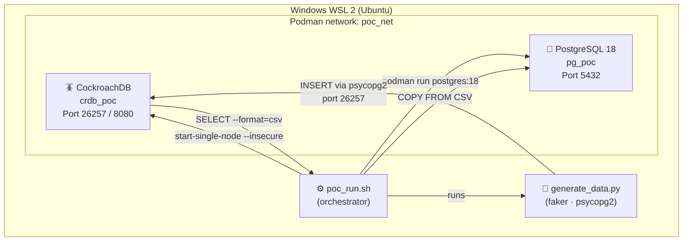
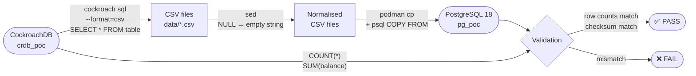
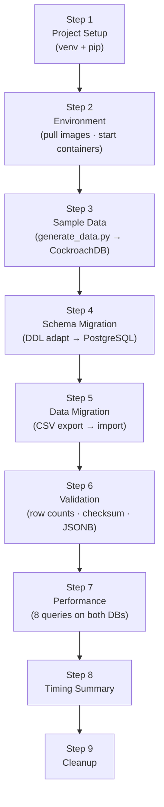

# CockroachDB → PostgreSQL Migration — Proof of Concept

> **Domain:** Banking &nbsp;|&nbsp; **Runtime:** Podman on WSL 2 (Ubuntu) &nbsp;|&nbsp; **Source:** CockroachDB latest &nbsp;|&nbsp; **Target:** PostgreSQL 18

A fully automated, **single-script** end-to-end PoC that migrates a realistic
banking dataset from CockroachDB to PostgreSQL 18 using rootless Podman
containers inside Windows WSL 2.

---

## Table of Contents

1. [Overview](#1-overview)
2. [Architecture](#2-architecture)
3. [Prerequisites](#3-prerequisites)
4. [Quick Start](#4-quick-start)
5. [Step 1 — Project Setup](#5-step-1--project-setup)
6. [Step 2 — Environment Configuration](#6-step-2--environment-configuration)
7. [Step 3 — Sample Data Preparation](#7-step-3--sample-data-preparation)
8. [Step 4 — Schema Migration](#8-step-4--schema-migration)
9. [Step 5 — Data Migration](#9-step-5--data-migration)
10. [Step 6 — Validation & Testing](#10-step-6--validation--testing)
11. [Step 7 — Performance Comparison](#11-step-7--performance-comparison)
12. [Step 8 — Timing Summary](#12-step-8--timing-summary)
13. [Step 9 — Cleanup](#13-step-9--cleanup)
14. [Actual Run Output](#14-actual-run-output)
15. [DDL Differences](#15-ddl-differences--cockroachdb-vs-postgresql-18)
16. [Known Gotchas & Fixes](#16-known-gotchas--fixes)
17. [Production Migration Checklist](#17-production-migration-checklist)

---

## 1. Overview

| Attribute | Value |
|-----------|-------|
| Source DB | CockroachDB (`docker.io/cockroachdb/cockroach:latest`) |
| Target DB | PostgreSQL 18 (`docker.io/library/postgres:18`) |
| Container runtime | Podman (rootless) on WSL 2 / Ubuntu 22.04–24.04 |
| Domain | Banking — `customers`, `accounts`, `transactions`, `loans` |
| Data types | `UUID`, `VARCHAR`, `DECIMAL(18,2)`, `DATE`, `TIMESTAMPTZ`, `BOOLEAN`, `JSONB` |
| Migration method | `cockroach sql --format=csv` → `sed` NULL normalisation → `psql COPY FROM` |
| Log files | One timestamped file per run: `logs/poc_run_YYMMDDHHMM.log` |

**Scale options:**

| Flag | Customers | Transactions | Total rows | Runtime |
|------|----------:|-------------:|-----------:|--------:|
| `--scale small` | 50 | ~1 000 | ~1 200 | < 2 min |
| `--scale medium` | 500 | ~19 000 | ~20 400 | ~4 min |
| `--scale large` | 5 000 | ~450 000 | ~480 000 | ~15 min |

---

## 2. Architecture

### Container topology



### Migration flow



### Step-by-step execution order



### Directory structure

```
~/CockroachDB2PG_POC/
├── poc_run.sh            ← orchestrator (single file)
├── schema/               ← DDL for both databases
├── scripts/              ← generate_data.py (auto-created)
├── data/                 ← CSV exports (temp, deleted after import)
└── logs/                 ← poc_run_YYMMDDHHMM.log  (one per run)
```

---

## 3. Prerequisites

Run these once on your WSL Ubuntu instance:

```bash
sudo apt-get update
sudo apt-get install -y podman python3 python3-venv python3-full
```

| Requirement | Notes |
|-------------|-------|
| WSL 2 (Ubuntu 22.04 or 24.04) | Enable with `wsl --install` in Windows |
| Podman 4.x+ | `sudo apt-get install -y podman` |
| Python 3.9+ with venv | `sudo apt-get install -y python3 python3-venv python3-full` |
| `faker`, `psycopg2-binary` | **Auto-installed by the script** into an isolated venv |
| Internet access (first run) | Pulls `cockroachdb/cockroach:latest` and `postgres:18` |

---

## 4. Quick Start

```bash
# Copy script from Windows to WSL home directory
cp /mnt/c/Users/<YourUser>/Downloads/poc_run.sh ~/
chmod +x ~/poc_run.sh

# Run with default medium scale
./poc_run.sh

# Other scales
./poc_run.sh --scale small            # ~1 200 rows  — quick demo
./poc_run.sh --scale medium           # ~20 400 rows — default
./poc_run.sh --scale large            # ~480 000 rows — stress test

# Keep containers alive after the run (for manual exploration)
./poc_run.sh --scale medium --no-cleanup
```

Each run creates a new timestamped log file:

```
~/CockroachDB2PG_POC/logs/poc_run_2606281422.log
                                      ^^^^^^^^^^
                                      YYMMDDHHMM
```

---

## 5. Step 1 — Project Setup

**What the script does:**

- Creates the working directory tree under `~/CockroachDB2PG_POC/`
- Creates an isolated Python virtual environment (Ubuntu 24.04 / PEP 668 safe)
- Installs `faker` and `psycopg2-binary` into the venv — no `sudo pip` needed

```bash
# Directory structure created
mkdir -p ~/CockroachDB2PG_POC/{data,schema,scripts,benchmark,logs}

# Virtual environment
python3 -m venv ~/CockroachDB2PG_POC/.venv
source ~/CockroachDB2PG_POC/.venv/bin/activate

# Python packages
pip install --quiet faker psycopg2-binary
```

**Expected output:**
```
── 1a. Python virtual environment ──────────────────────────────────
  ➜  Creating venv at ~/CockroachDB2PG_POC/.venv ...
  ✓  venv created: ~/CockroachDB2PG_POC/.venv
  ➜  Installing Python packages (faker, psycopg2-binary) into venv ...
  ✓  Packages installed: faker 40.23.0, psycopg2 2.9.12 (dt dec pq3 ext lo64)
  ✓  Step 1 — Project Setup — elapsed: 6s
```

---

## 6. Step 2 — Environment Configuration

**What the script does:**

- Pulls both container images (fully-qualified names for Ubuntu compatibility)
- Creates an isolated Podman bridge network `poc_net`
- Removes any stale containers **and volumes** from previous runs
- Starts CockroachDB in single-node insecure mode
- Starts PostgreSQL 18 with the correct volume mount path for PG 18+

### 2b. Pull container images

```bash
# Always use fully-qualified names — Ubuntu has no default registry search
podman pull docker.io/cockroachdb/cockroach:latest
podman pull docker.io/library/postgres:18
```

> **PostgreSQL 18 volume change:** PG 18's Docker image mounts at
> `/var/lib/postgresql` (not `/var/lib/postgresql/data`). The image
> manages the major-version subdirectory automatically. Do **not** set
> `PGDATA` for PG 18+.

### 2c. Create Podman network

```bash
podman network create poc_net
```

### 2d. Remove stale containers and volumes

```bash
# Containers
for C in crdb_poc pg_poc; do
  podman container exists "$C" && podman rm -f "$C"
done

# Volumes — must also be removed; stale PG data causes immediate crash on re-run
for V in crdb_poc_data pg_poc_data; do
  podman volume exists "$V" && podman volume rm "$V"
done
```

### 2e. Start CockroachDB

```bash
podman run -d \
  --name crdb_poc \
  --network poc_net \
  -p 26257:26257 \
  -p 8080:8080 \
  -v crdb_poc_data:/cockroach/cockroach-data:Z \
  docker.io/cockroachdb/cockroach:latest start-single-node \
  --insecure \
  --advertise-addr=crdb_poc

# Wait until ready (up to 60s)
until podman exec crdb_poc ./cockroach sql --insecure --execute="SELECT 1;" &>/dev/null; do
  sleep 1
done

# Create database and user
podman exec crdb_poc ./cockroach sql --insecure \
  --execute="CREATE DATABASE IF NOT EXISTS banking;"
podman exec crdb_poc ./cockroach sql --insecure \
  --execute="CREATE USER IF NOT EXISTS poc_user; GRANT ALL ON DATABASE banking TO poc_user;"
```

### 2f. Start PostgreSQL 18

```bash
podman run -d \
  --name pg_poc \
  --network poc_net \
  -p 5432:5432 \
  -e POSTGRES_USER=poc_user \
  -e POSTGRES_PASSWORD=poc_pass \
  -e POSTGRES_DB=banking \
  -v pg_poc_data:/var/lib/postgresql:Z \
  docker.io/library/postgres:18

# Wait until ready (up to 90s) — with early-exit crash detection
until podman exec pg_poc pg_isready -U poc_user &>/dev/null; do
  sleep 1
done
```

**Expected output:**
```
── 2g. Container status ───────────────────────────────────────────
NAMES       STATUS         PORTS
crdb_poc    Up 8 seconds   0.0.0.0:8080->8080/tcp, 0.0.0.0:26257->26257/tcp
pg_poc      Up 2 seconds   0.0.0.0:5432->5432/tcp
  ✓  Step 2 — Environment — elapsed: 45s
```

---

## 7. Step 3 — Sample Data Preparation

**What the script does:**

- Writes `schema/cockroach_schema.sql` and applies it to CockroachDB
- Writes `scripts/generate_data.py` (banking data generator using `faker`)
- Runs the generator to insert data directly into CockroachDB

### Banking schema (CockroachDB)

```sql
USE banking;

CREATE TABLE IF NOT EXISTS customers (
    customer_id     UUID          DEFAULT gen_random_uuid() PRIMARY KEY,
    first_name      VARCHAR(100)  NOT NULL,
    last_name       VARCHAR(100)  NOT NULL,
    email           VARCHAR(255)  NOT NULL UNIQUE,
    phone           VARCHAR(20),
    date_of_birth   DATE          NOT NULL,
    address         JSONB,
    kyc_data        JSONB,
    credit_score    INTEGER       CHECK (credit_score BETWEEN 300 AND 850),
    is_active       BOOLEAN       DEFAULT TRUE,
    created_at      TIMESTAMPTZ   DEFAULT now(),
    updated_at      TIMESTAMPTZ   DEFAULT now()
);

CREATE TABLE IF NOT EXISTS accounts (
    account_id      UUID          DEFAULT gen_random_uuid() PRIMARY KEY,
    customer_id     UUID          NOT NULL REFERENCES customers(customer_id),
    account_number  VARCHAR(20)   NOT NULL UNIQUE,
    account_type    VARCHAR(20)   NOT NULL
                    CHECK (account_type IN ('SAVINGS','CHECKING','LOAN','CREDIT')),
    balance         DECIMAL(18,2) NOT NULL DEFAULT 0.00,
    currency        VARCHAR(3)    NOT NULL DEFAULT 'USD',
    status          VARCHAR(20)   NOT NULL DEFAULT 'ACTIVE',
    metadata        JSONB,
    opened_date     DATE          NOT NULL DEFAULT current_date(),
    closed_date     DATE,
    created_at      TIMESTAMPTZ   DEFAULT now()
);

CREATE TABLE IF NOT EXISTS transactions (
    transaction_id  UUID          DEFAULT gen_random_uuid() PRIMARY KEY,
    account_id      UUID          NOT NULL REFERENCES accounts(account_id),
    txn_type        VARCHAR(30)   NOT NULL
                    CHECK (txn_type IN ('CREDIT','DEBIT','TRANSFER','FEE','INTEREST')),
    amount          DECIMAL(18,2) NOT NULL,
    balance_after   DECIMAL(18,2) NOT NULL,
    description     VARCHAR(500),
    channel         VARCHAR(20)   DEFAULT 'ONLINE',
    txn_metadata    JSONB,
    reference_id    VARCHAR(100),
    status          VARCHAR(20)   DEFAULT 'COMPLETED',
    txn_date        DATE          NOT NULL DEFAULT current_date(),
    created_at      TIMESTAMPTZ   DEFAULT now()
);

CREATE TABLE IF NOT EXISTS loans (
    loan_id         UUID          DEFAULT gen_random_uuid() PRIMARY KEY,
    customer_id     UUID          NOT NULL REFERENCES customers(customer_id),
    account_id      UUID          REFERENCES accounts(account_id),
    loan_type       VARCHAR(30)   NOT NULL
                    CHECK (loan_type IN ('HOME','AUTO','PERSONAL','EDUCATION','BUSINESS')),
    principal       DECIMAL(18,2) NOT NULL,
    interest_rate   DECIMAL(6,4)  NOT NULL,
    tenure_months   INTEGER       NOT NULL,
    emi_amount      DECIMAL(18,2) NOT NULL,
    outstanding     DECIMAL(18,2) NOT NULL,
    disbursed_date  DATE,
    maturity_date   DATE,
    loan_status     VARCHAR(20)   DEFAULT 'ACTIVE',
    collateral      JSONB,
    loan_metadata   JSONB,
    created_at      TIMESTAMPTZ   DEFAULT now()
);

CREATE INDEX IF NOT EXISTS idx_acct_customer  ON accounts(customer_id);
CREATE INDEX IF NOT EXISTS idx_txn_acct_date  ON transactions(account_id, txn_date DESC);
CREATE INDEX IF NOT EXISTS idx_txn_date       ON transactions(txn_date DESC);
CREATE INDEX IF NOT EXISTS idx_loans_customer ON loans(customer_id);
```

### Apply schema and generate data

```bash
# Apply schema to CockroachDB
podman cp ~/CockroachDB2PG_POC/schema/cockroach_schema.sql crdb_poc:/tmp/cockroach_schema.sql
podman exec crdb_poc ./cockroach sql --insecure --file=/tmp/cockroach_schema.sql

# Generate data (medium scale example)
~/CockroachDB2PG_POC/.venv/bin/python \
  ~/CockroachDB2PG_POC/scripts/generate_data.py \
  --scale medium \
  --host localhost --port 26257 \
  --dbname banking --user root
```

**Expected output:**
```
── 3c. Generate banking data (scale=medium) ───────────────────────
  Scale=MEDIUM  customers=500  txn/acct~20
    Inserting 500 customers ... done in 1.6s
    Inserting accounts (~2/customer) ... 758 accounts in 1.9s
    Inserting transactions (~20/account) ... 18,970 rows in 56.7s
    Inserting 200 loans ... done in 0.7s

  Total time: 61.1s
  Row counts:
    customers      :        500
    accounts       :        758
    transactions   :     18,970
    loans          :        200
  ✓  Step 3 — Sample Data Preparation — elapsed: 65s
```

---

## 8. Step 4 — Schema Migration

**What the script does:**

- Writes the adapted `schema/postgres_schema.sql`
- Applies it to PostgreSQL 18

### Key DDL adaptations

| CockroachDB | PostgreSQL 18 | Change required |
|-------------|---------------|-----------------|
| `current_date()` | `CURRENT_DATE` | Function → keyword |
| `gen_random_uuid()` built-in | `gen_random_uuid()` via `pgcrypto` | Add `CREATE EXTENSION pgcrypto` |
| JSONB | JSONB | No change — identical syntax |
| `TIMESTAMPTZ DEFAULT now()` | `TIMESTAMPTZ DEFAULT NOW()` | No change |
| `DECIMAL(18,2)` | `DECIMAL(18,2)` | No change |
| No GIN index (single-node) | GIN indexes on JSONB | Added as bonus |
| `INTERLEAVE / SPLIT AT` | Remove | No PG equivalent |

### PostgreSQL 18 schema

```sql
CREATE EXTENSION IF NOT EXISTS pgcrypto;

CREATE TABLE IF NOT EXISTS customers (
    customer_id     UUID          DEFAULT gen_random_uuid() PRIMARY KEY,
    first_name      VARCHAR(100)  NOT NULL,
    last_name       VARCHAR(100)  NOT NULL,
    email           VARCHAR(255)  NOT NULL UNIQUE,
    phone           VARCHAR(20),
    date_of_birth   DATE          NOT NULL,
    address         JSONB,
    kyc_data        JSONB,
    credit_score    INTEGER       CHECK (credit_score BETWEEN 300 AND 850),
    is_active       BOOLEAN       DEFAULT TRUE,
    created_at      TIMESTAMPTZ   DEFAULT NOW(),
    updated_at      TIMESTAMPTZ   DEFAULT NOW()
);

CREATE TABLE IF NOT EXISTS accounts (
    account_id      UUID          DEFAULT gen_random_uuid() PRIMARY KEY,
    customer_id     UUID          NOT NULL REFERENCES customers(customer_id),
    account_number  VARCHAR(20)   NOT NULL UNIQUE,
    account_type    VARCHAR(20)   NOT NULL
                    CHECK (account_type IN ('SAVINGS','CHECKING','LOAN','CREDIT')),
    balance         DECIMAL(18,2) NOT NULL DEFAULT 0.00,
    currency        VARCHAR(3)    NOT NULL DEFAULT 'USD',
    status          VARCHAR(20)   NOT NULL DEFAULT 'ACTIVE',
    metadata        JSONB,
    opened_date     DATE          NOT NULL DEFAULT CURRENT_DATE,
    closed_date     DATE,
    created_at      TIMESTAMPTZ   DEFAULT NOW()
);

CREATE TABLE IF NOT EXISTS transactions (
    transaction_id  UUID          DEFAULT gen_random_uuid() PRIMARY KEY,
    account_id      UUID          NOT NULL REFERENCES accounts(account_id),
    txn_type        VARCHAR(30)   NOT NULL
                    CHECK (txn_type IN ('CREDIT','DEBIT','TRANSFER','FEE','INTEREST')),
    amount          DECIMAL(18,2) NOT NULL,
    balance_after   DECIMAL(18,2) NOT NULL,
    description     VARCHAR(500),
    channel         VARCHAR(20)   DEFAULT 'ONLINE',
    txn_metadata    JSONB,
    reference_id    VARCHAR(100),
    status          VARCHAR(20)   DEFAULT 'COMPLETED',
    txn_date        DATE          NOT NULL DEFAULT CURRENT_DATE,
    created_at      TIMESTAMPTZ   DEFAULT NOW()
);

CREATE TABLE IF NOT EXISTS loans (
    loan_id         UUID          DEFAULT gen_random_uuid() PRIMARY KEY,
    customer_id     UUID          NOT NULL REFERENCES customers(customer_id),
    account_id      UUID          REFERENCES accounts(account_id),
    loan_type       VARCHAR(30)   NOT NULL
                    CHECK (loan_type IN ('HOME','AUTO','PERSONAL','EDUCATION','BUSINESS')),
    principal       DECIMAL(18,2) NOT NULL,
    interest_rate   DECIMAL(6,4)  NOT NULL,
    tenure_months   INTEGER       NOT NULL,
    emi_amount      DECIMAL(18,2) NOT NULL,
    outstanding     DECIMAL(18,2) NOT NULL,
    disbursed_date  DATE,
    maturity_date   DATE,
    loan_status     VARCHAR(20)   DEFAULT 'ACTIVE',
    collateral      JSONB,
    loan_metadata   JSONB,
    created_at      TIMESTAMPTZ   DEFAULT NOW()
);

-- B-tree indexes
CREATE INDEX IF NOT EXISTS idx_acct_customer  ON accounts(customer_id);
CREATE INDEX IF NOT EXISTS idx_txn_acct_date  ON transactions(account_id, txn_date DESC);
CREATE INDEX IF NOT EXISTS idx_txn_date       ON transactions(txn_date DESC);
CREATE INDEX IF NOT EXISTS idx_loans_customer ON loans(customer_id);

-- GIN indexes on JSONB (not available in CockroachDB single-node)
CREATE INDEX IF NOT EXISTS idx_gin_cust_addr ON customers  USING GIN (address);
CREATE INDEX IF NOT EXISTS idx_gin_txn_meta  ON transactions USING GIN (txn_metadata);
CREATE INDEX IF NOT EXISTS idx_gin_acct_meta ON accounts   USING GIN (metadata);
```

### Apply schema to PostgreSQL 18

```bash
podman cp ~/CockroachDB2PG_POC/schema/postgres_schema.sql pg_poc:/tmp/postgres_schema.sql
podman exec pg_poc psql -U poc_user -d banking -f /tmp/postgres_schema.sql
```

**Expected output:**
```
CREATE EXTENSION
CREATE TABLE
CREATE TABLE
CREATE TABLE
CREATE TABLE
CREATE INDEX
CREATE INDEX
CREATE INDEX
CREATE INDEX
CREATE INDEX
CREATE INDEX
CREATE INDEX
  ✓  PostgreSQL schema applied
  ✓  Step 4 — Schema Migration — elapsed: 1s
```

---

## 9. Step 5 — Data Migration

**What the script does:**

- Exports each table from CockroachDB as CSV using `--format=csv`
- Normalises `NULL` tokens with `sed` (CockroachDB outputs the literal word `NULL`)
- Disables FK triggers in PostgreSQL for bulk-load speed
- Imports each CSV into PostgreSQL using `psql COPY FROM`
- Re-enables FK triggers

### 5a. Export from CockroachDB

```bash
# Tables must be exported in FK-safe order
for TABLE in customers accounts transactions loans; do

  podman exec crdb_poc ./cockroach sql \
    --insecure --database=banking \
    --format=csv \
    --execute="SELECT * FROM $TABLE" \
    2>/dev/null \
  | sed \
      -e 's/,NULL,/,,/g' \
      -e 's/,NULL$/,/g'  \
      -e 's/^NULL,/,/g'  \
    > ~/CockroachDB2PG_POC/data/${TABLE}.csv

  echo "$TABLE: $(( $(wc -l < ~/CockroachDB2PG_POC/data/${TABLE}.csv) - 1 )) rows"
done
```

> **Why `sed`?** `cockroach sql --format=csv` renders SQL `NULL` as the
> literal four-character string `NULL`. The `sed` pass converts every bare
> `NULL` field token to an empty string so PostgreSQL `COPY FROM` with
> `NULL ''` correctly interprets them as SQL `NULL`.

### 5b. Import into PostgreSQL 18

```bash
# Disable FK trigger checks for bulk-load speed
podman exec pg_poc psql -U poc_user -d banking \
  -c "SET session_replication_role = 'replica';"

for TABLE in customers accounts transactions loans; do

  # Copy CSV file into the container filesystem
  podman cp ~/CockroachDB2PG_POC/data/${TABLE}.csv pg_poc:/tmp/${TABLE}.csv

  # Import using psql COPY FROM
  podman exec pg_poc psql -U poc_user -d banking \
    -c "\COPY $TABLE FROM '/tmp/${TABLE}.csv' WITH (FORMAT CSV, HEADER TRUE, DELIMITER ',', NULL '');"

done

# Re-enable FK checks
podman exec pg_poc psql -U poc_user -d banking \
  -c "SET session_replication_role = 'origin';"
```

**Expected output:**
```
── 5a. Export data from CockroachDB (SELECT --format=csv) ─────────
  ✓  customers    → customers.csv    |  rows: 500    |  1s
  ✓  accounts     → accounts.csv     |  rows: 758    |  1s
  ✓  transactions → transactions.csv |  rows: 18970  |  1s
  ✓  loans        → loans.csv        |  rows: 200    |  1s

CSV export sizes:
    201K    customers.csv
    222K    accounts.csv
    6.5M    transactions.csv
     78K    loans.csv

── 5b. Import data into PostgreSQL (COPY FROM) ────────────────────
COPY 500
  ✓  customers imported    |  PG rows: 500    |  2s
COPY 758
  ✓  accounts imported     |  PG rows: 758    |  2s
COPY 18970
  ✓  transactions imported |  PG rows: 18970  |  2s
COPY 200
  ✓  loans imported        |  PG rows: 200    |  2s
  ✓  Step 5 — Data Migration — elapsed: 13s
```

---

## 10. Step 6 — Validation & Testing

### 6a. Row count parity

```sql
-- Run on both CockroachDB and PostgreSQL — counts must match
SELECT COUNT(*) FROM customers;
SELECT COUNT(*) FROM accounts;
SELECT COUNT(*) FROM transactions;
SELECT COUNT(*) FROM loans;
```

### 6b. Schema consistency

```sql
-- Verify column types in PostgreSQL
SELECT table_name, column_name, data_type, is_nullable
FROM information_schema.columns
WHERE table_schema = 'public'
  AND table_name IN ('customers','accounts','transactions','loans')
ORDER BY table_name, ordinal_position;
```

### 6c. JSONB field validation

```sql
-- Customer address completeness
SELECT
  COUNT(*)                                              AS total,
  COUNT(*) FILTER (WHERE address IS NOT NULL)           AS has_address,
  COUNT(*) FILTER (WHERE address->>'city' IS NOT NULL)  AS has_city,
  COUNT(*) FILTER (WHERE address->>'country' = 'US')    AS country_us,
  COUNT(*) FILTER (WHERE kyc_data->>'verified' = 'true') AS kyc_verified
FROM customers;

-- Transaction metadata category breakdown
SELECT txn_metadata->>'category'       AS category,
       COUNT(*)                         AS txn_count,
       ROUND(SUM(amount)::numeric, 2)   AS total_amt
FROM transactions
WHERE txn_metadata IS NOT NULL
GROUP BY 1 ORDER BY 3 DESC LIMIT 8;

-- Account JSONB features array
SELECT account_type,
       jsonb_array_elements_text(metadata->'features') AS feature,
       COUNT(*) AS cnt
FROM accounts
WHERE metadata->'features' IS NOT NULL
GROUP BY 1, 2 ORDER BY 1, 3 DESC;

-- Loan collateral over $100K
SELECT loan_type,
       collateral->>'type'                       AS coll_type,
       ROUND((collateral->>'value')::numeric, 2) AS coll_value,
       loan_status
FROM loans
WHERE (collateral->>'value')::numeric > 100000
ORDER BY 3 DESC LIMIT 10;
```

### 6d. Aggregate checksum (must match CockroachDB)

```sql
-- CockroachDB
SELECT ROUND(SUM(balance), 2) FROM accounts;

-- PostgreSQL
SELECT ROUND(SUM(balance)::numeric, 2) FROM accounts;
```

**Expected output:**
```
── 6a. Row count validation ───────────────────────────────────────
  TABLE               COCKROACHDB   POSTGRESQL    STATUS
  ──────────────────  ────────────  ────────────  ──────
  customers           500           500           PASS
  accounts            758           758           PASS
  transactions        18970         18970         PASS
  loans               200           200           PASS

── 6d. Aggregate checksum ─────────────────────────────────────────
  SUM(accounts.balance)  CockroachDB: 19178076.24  PostgreSQL: 19178076.24  MATCH

  ✓  All validation checks PASSED (5 checks)
  ✓  Step 6 — Validation — elapsed: 9s
```

---

## 11. Step 7 — Performance Comparison

Eight queries timed on both databases (single warm run, medium scale):

```sql
-- Q1: Simple aggregate
SELECT COUNT(*) FROM transactions;

-- Q2: Monthly volume (last 12 months)
SELECT DATE_TRUNC('month', txn_date::TIMESTAMP) AS mo,
       COUNT(*) AS n, SUM(amount) AS vol
FROM transactions
WHERE txn_date >= CURRENT_DATE - INTERVAL '12 months'
GROUP BY 1 ORDER BY 1;

-- Q3: Top 10 customers by transaction volume (3-table JOIN)
SELECT c.customer_id, c.first_name, c.last_name,
       COUNT(t.transaction_id) AS txn_cnt, SUM(t.amount) AS total
FROM customers c
JOIN accounts     a ON c.customer_id = a.customer_id
JOIN transactions t ON a.account_id  = t.account_id
GROUP BY 1, 2, 3 ORDER BY 5 DESC LIMIT 10;

-- Q4: JSONB category breakdown
SELECT txn_metadata->>'category' AS cat,
       COUNT(*) AS n, SUM(amount) AS vol
FROM transactions
WHERE txn_metadata IS NOT NULL
GROUP BY 1 ORDER BY 3 DESC;

-- Q5: Window function — running balance per account
SELECT account_id, txn_date, amount,
       SUM(amount) OVER (PARTITION BY account_id
                         ORDER BY txn_date, created_at) AS running_bal
FROM transactions LIMIT 2000;

-- Q6: 4-table customer summary
SELECT c.customer_id,
       COUNT(DISTINCT l.loan_id)        AS loans,
       COUNT(DISTINCT t.transaction_id) AS txns,
       COALESCE(SUM(l.outstanding), 0)  AS total_outstanding,
       COALESCE(SUM(t.amount), 0)       AS total_txn_vol
FROM customers c
LEFT JOIN loans        l ON c.customer_id = l.customer_id
LEFT JOIN accounts     a ON c.customer_id = a.customer_id
LEFT JOIN transactions t ON a.account_id  = t.account_id
GROUP BY 1 ORDER BY 4 DESC LIMIT 20;

-- Q7: JSONB array containment
SELECT account_type, COUNT(*) AS n
FROM accounts
WHERE metadata->'features' ? 'cashback'
GROUP BY 1;

-- Q8: Loans with high-value collateral
SELECT loan_type,
       ROUND(AVG(principal)::NUMERIC, 2)     AS avg_principal,
       ROUND(AVG(interest_rate)::NUMERIC, 4) AS avg_rate,
       COUNT(*) AS cnt
FROM loans
WHERE (collateral->>'value')::NUMERIC > 50000
GROUP BY 1 ORDER BY 2 DESC;
```

**Results (medium scale — actual run):**

| Query | CockroachDB (ms) | PostgreSQL 18 (ms) | PG speedup |
|-------|----------------:|------------------:|:----------:|
| Q1 · COUNT(*) transactions | 828 | 536 | 1.5× |
| Q2 · Monthly volume (12 months) | 751 | 529 | 1.4× |
| Q3 · Top 10 customers (JOIN) | 898 | 559 | 1.6× |
| Q4 · JSONB category breakdown | 983 | 631 | 1.6× |
| Q5 · Window fn: running balance | 983 | 624 | 1.6× |
| Q6 · 4-table customer summary | 1009 | 451 | **2.2×** |
| Q7 · JSONB array contains | 829 | 542 | 1.5× |
| Q8 · High-value loans | 759 | 527 | 1.4× |

> **Note:** CockroachDB single-node adds distributed-consensus overhead on
> every operation. This is not representative of its production distributed
> mode. CockroachDB's value is horizontal scale-out and multi-region HA —
> not comparable to a standalone PostgreSQL node.

---

## 12. Step 8 — Timing Summary

**Actual medium-scale run timings:**

```
  STEP                                      ELAPSED
  ────────────────────────────────────────  ──────────
  Step 1 — Project Setup                       6s
  Step 2 — Environment                        45s
  Step 3 — Sample Data Preparation            65s
  Step 4 — Schema Migration                    1s
  Step 5 — Data Migration                     13s
  Step 6 — Validation                          9s
  Step 7 — Performance                        11s
  ────────────────────────────────────────  ──────────
  TOTAL END-TO-END                           150s
```

---

## 13. Step 9 — Cleanup

The script automatically cleans up after a normal run. To do it manually:

```bash
# Stop and remove containers
podman stop  crdb_poc pg_poc
podman rm -f crdb_poc pg_poc

# Remove volumes
podman volume rm crdb_poc_data pg_poc_data

# Remove network
podman network rm poc_net

# Remove temporary CSV exports
rm -f ~/CockroachDB2PG_POC/data/*.csv

# Remove Python virtual environment
rm -rf ~/CockroachDB2PG_POC/.venv
```

### Manual exploration (--no-cleanup mode)

```bash
# Run keeping containers alive
./poc_run.sh --scale medium --no-cleanup

# Connect to CockroachDB SQL shell
podman exec -it crdb_poc ./cockroach sql --insecure --database=banking

# Connect to PostgreSQL shell
podman exec -it pg_poc psql -U poc_user -d banking

# CockroachDB Admin UI
# Open in browser: http://localhost:8080

# Check running containers
podman ps
```

---

## 14. Actual Run Output

Full successful run (medium scale, `./poc_run.sh --scale medium`):

```
════════════════════════════════════════════════════════════════════
                CockroachDB → PostgreSQL Migration PoC
════════════════════════════════════════════════════════════════════

  Scale: medium  |  Auto-cleanup: true

  ✓  Step 1 — Project Setup — elapsed: 6s
  ✓  Step 2 — Environment — elapsed: 45s
  ✓  Step 3 — Sample Data Preparation — elapsed: 65s
  ✓  Step 4 — Schema Migration — elapsed: 1s
  ✓  Step 5 — Data Migration — elapsed: 13s

  TABLE               COCKROACHDB   POSTGRESQL    STATUS
  customers           500           500           PASS
  accounts            758           758           PASS
  transactions        18970         18970         PASS
  loans               200           200           PASS

  SUM(accounts.balance)  CockroachDB: 19178076.24  PostgreSQL: 19178076.24  MATCH
  ✓  All validation checks PASSED (5 checks)
  ✓  Step 6 — Validation — elapsed: 9s

  QUERY                                               CRDB (ms)   PG (ms)
  Q1 · COUNT(*) transactions                            828 ms      536 ms
  Q2 · Monthly volume (last 12 months)                  751 ms      529 ms
  Q3 · Top 10 customers by txn volume                   898 ms      559 ms
  Q4 · JSONB category breakdown                         983 ms      631 ms
  Q5 · Window fn: running balance                       983 ms      624 ms
  Q6 · 4-table customer summary                        1009 ms      451 ms
  Q7 · JSONB array contains 'cashback'                  829 ms      542 ms
  Q8 · High-value loans with collateral                 759 ms      527 ms
  ✓  Step 7 — Performance — elapsed: 11s

  TOTAL END-TO-END  150s

════════════════════════════════════════════════════════════════════
                             PoC COMPLETE
════════════════════════════════════════════════════════════════════
  ✓  Total elapsed : 205s
  ✓  Log file      : ~/CockroachDB2PG_POC/logs/poc_run_2606281422.log
```

---

## 15. DDL Differences — CockroachDB vs PostgreSQL 18

```
┌────────────────────────────────┬──────────────────────────────────────┐
│ CockroachDB                    │ PostgreSQL 18                        │
├────────────────────────────────┼──────────────────────────────────────┤
│ current_date()  (function)     │ CURRENT_DATE  (keyword)              │
│ gen_random_uuid() (built-in)   │ gen_random_uuid() via pgcrypto ext   │
│ JSONB (native)                 │ JSONB (native, identical syntax)     │
│ TIMESTAMPTZ DEFAULT now()      │ TIMESTAMPTZ DEFAULT NOW()  (same)    │
│ DECIMAL(18,2)                  │ DECIMAL(18,2)  (identical)           │
│ No GIN index (single-node)     │ GIN indexes on JSONB (full support)  │
│ INTERLEAVE / SPLIT AT          │ Remove — use PG partitioning instead │
└────────────────────────────────┴──────────────────────────────────────┘
```

---

## 16. Known Gotchas & Fixes

| Symptom | Root cause | Fix |
|---------|-----------|-----|
| Step 5 hangs at "Exporting …" forever | `\COPY` is a psql meta-command — `cockroach sql` does not support it and silently does nothing | Use `--format=csv` + `SELECT *` instead |
| `invalid input syntax for type date: "NULL"` | `cockroach --format=csv` renders SQL `NULL` as the literal word `NULL` | `sed` pass converts bare `NULL` tokens to empty strings before import |
| PostgreSQL container exits immediately on startup | `postgres:latest` is now PG 18 which changed the volume mount path from `/var/lib/postgresql/data` to `/var/lib/postgresql` | Pin to `postgres:18`; mount volume at `/var/lib/postgresql` — do not set `PGDATA` |
| Second run crashes — "data directory incompatible" | Stale named volume `pg_poc_data` left from previous run | Script removes both containers **and** volumes in step 2d before each run |
| Script silently exits after printing validation header | `(( PASS++ ))` returns exit code 1 when `PASS=0`; fatal under `set -e` | All arithmetic counters use `(( n++ )) \|\| true` |
| `#!/usr/bin/env: No such file or directory` in WSL | UTF-8 BOM prepended by Windows PowerShell `Set-Content` | Save with `[System.IO.File]::WriteAllText` + `UTF8Encoding($false)` (no BOM, LF line endings) |

---

## 17. Production Migration Checklist

- [ ] Full CockroachDB backup completed before migration window
- [ ] Application writes paused — traffic cut to read-only mode
- [ ] Schema DDL diff reviewed by DBA — apply adaptations listed in §15
- [ ] Data exported in FK-safe order: `customers → accounts → transactions → loans`
- [ ] FK constraints disabled during import (`SET session_replication_role = 'replica'`)
- [ ] FK constraints re-enabled after import (`SET session_replication_role = 'origin'`)
- [ ] Row count validation passed for all tables (zero mismatches)
- [ ] Aggregate checksum (`SUM(balance)`) matches between source and target
- [ ] JSONB field spot-checks completed for all JSONB columns
- [ ] Application smoke tests run against PostgreSQL target
- [ ] All connection strings / DSNs updated in application config
- [ ] PostgreSQL monitored (`pg_stat_activity`, slow query log) for 48 h post-cutover
- [ ] CockroachDB cluster kept in read-only standby for rollback window

---

## Repository Structure

```
.
├── poc_run.sh                  ← single-file PoC orchestrator
└── README.md                   ← this file

Generated at runtime under ~/CockroachDB2PG_POC/
├── schema/
│   ├── cockroach_schema.sql    ← source DDL (banking domain, CockroachDB)
│   └── postgres_schema.sql     ← adapted target DDL (PostgreSQL 18)
├── scripts/
│   └── generate_data.py        ← scalable banking data generator (faker)
├── data/
│   ├── customers.csv           ← temp (deleted after import)
│   ├── accounts.csv
│   ├── transactions.csv
│   └── loans.csv
└── logs/
    └── poc_run_YYMMDDHHMM.log  ← one timestamped log file per run
```

---

*CockroachDB → PostgreSQL 18 Migration PoC &nbsp;·&nbsp; Podman on WSL 2 &nbsp;·&nbsp; Banking Domain*
